# Prismavent

**Plataforma integral para la planificación y gestión de eventos.**

[](https://github.com/dypok/prismavent)
[](https://prismavent.vercel.app)
[](https://github.com/dypok/prismavent)

Prismavent permite crear, organizar y supervisar bodas, conferencias, cumpleaños y celebraciones desde un único lugar — gestionando invitados, presupuestos, proveedores, tareas y más.

**Autor Principal y Líder Técnico:** Dylan Gamero  
**Escuadrón de Desarrollo:** Sayder, Daniel, Bryan, Leonardo, Dilan

---

## Capturas de Pantalla

| Landing Page | Dashboard | Login |
|---|---|---|
| 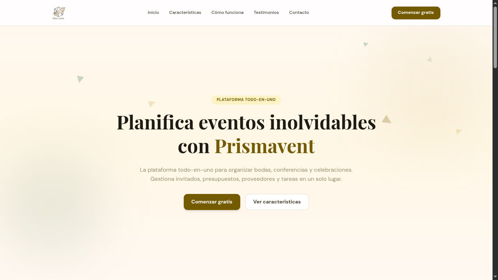 | 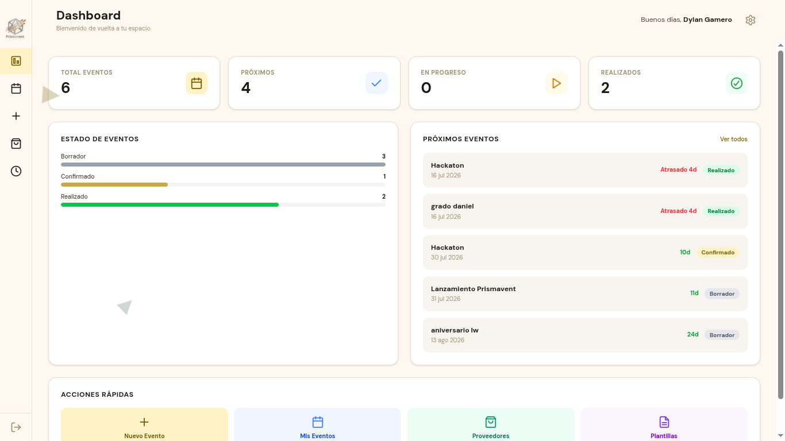 | 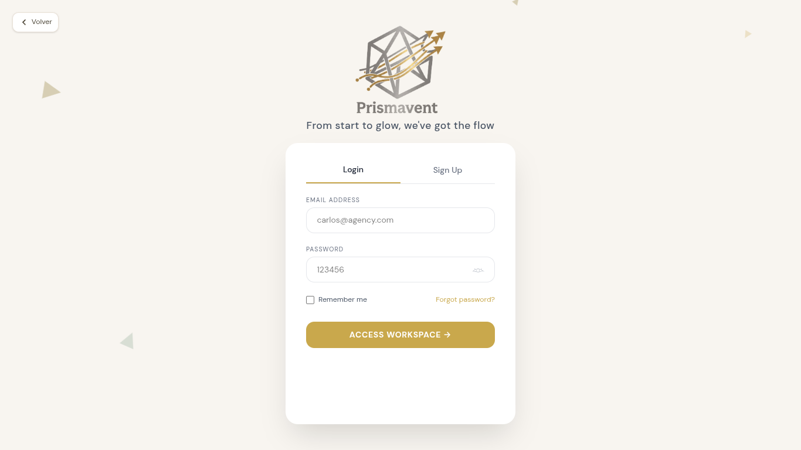 |

| Mis Eventos | Crear Evento | Detalle del Evento |
|---|---|---|
| 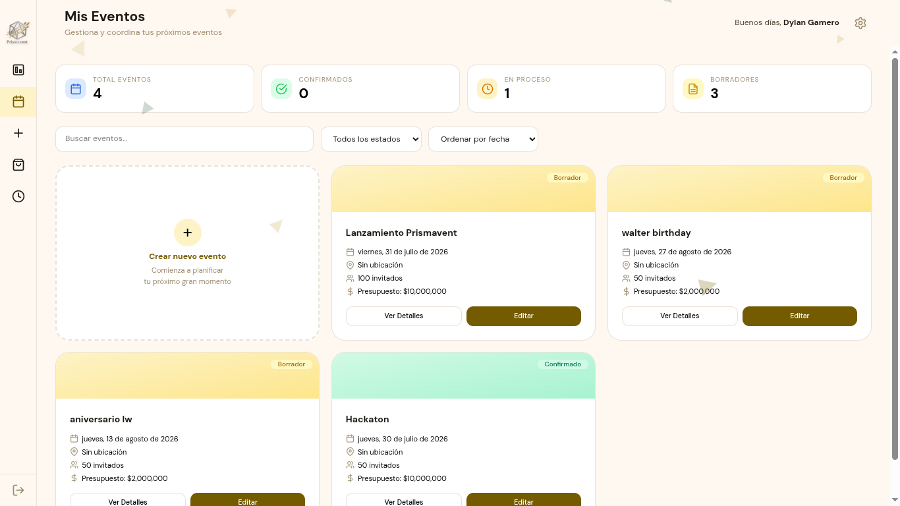 | 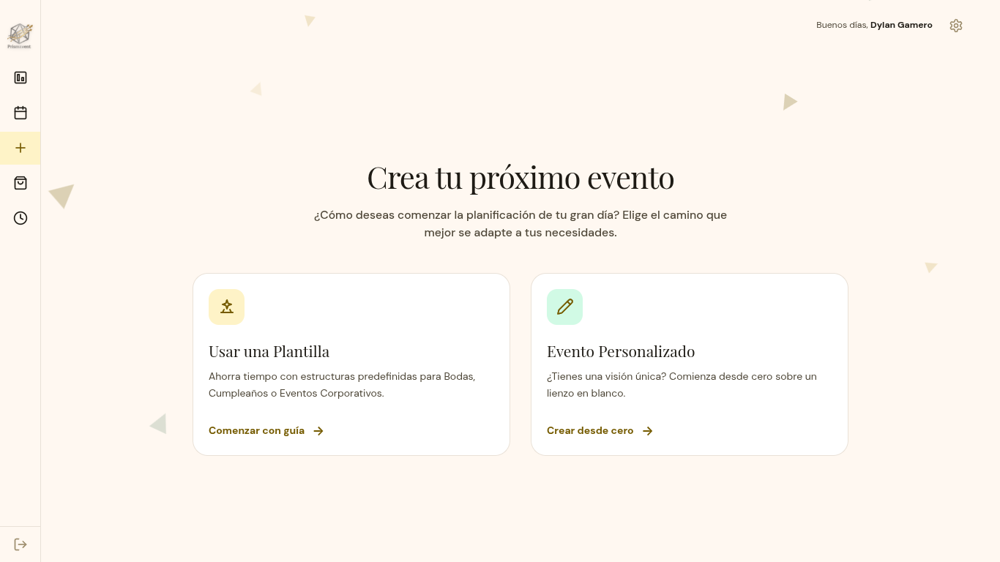 | 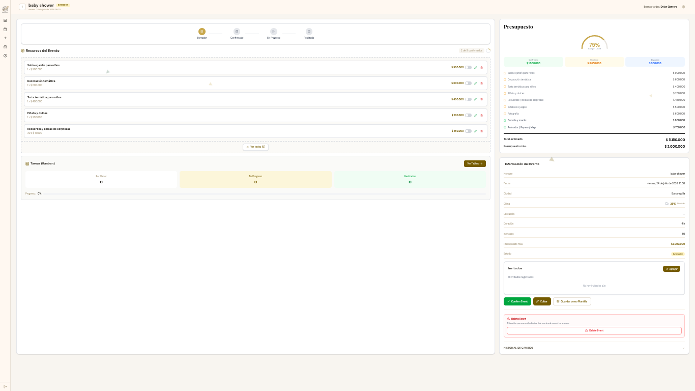 |

| Plantillas | Kanban | Historial |
|---|---|---|
| 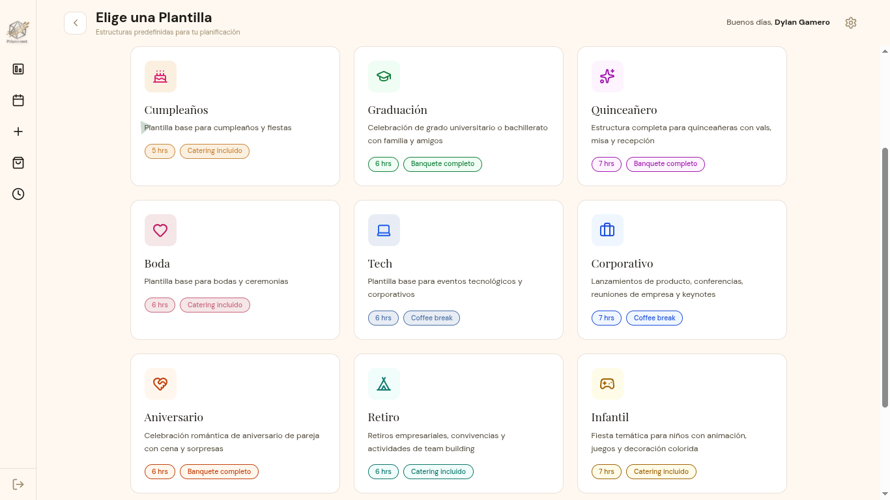 | 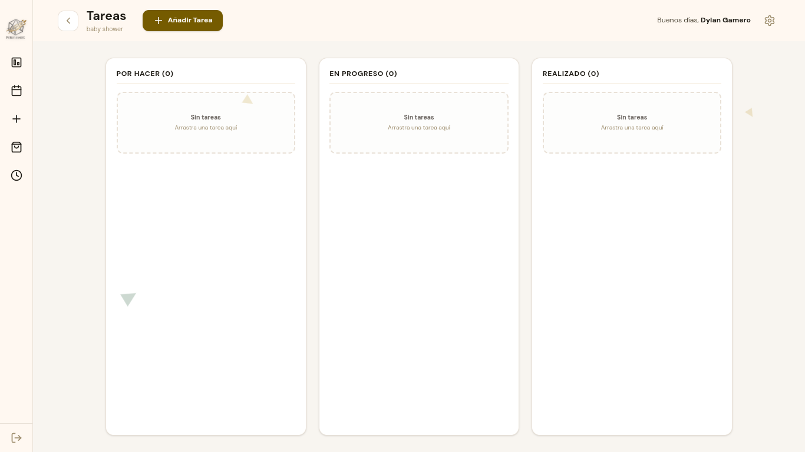 | 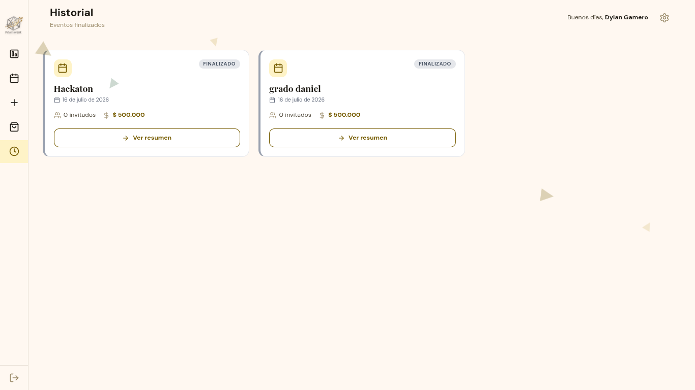 |

| Proveedores | Panel Admin | Editar Proveedores |
|---|---|---|
| 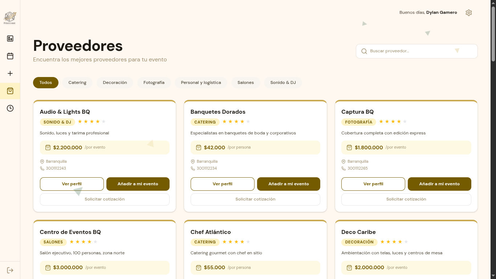 | 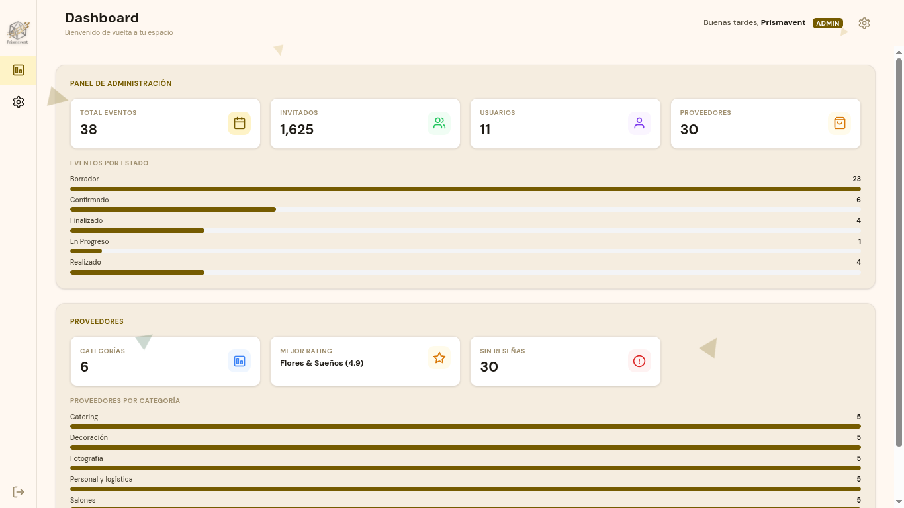 | 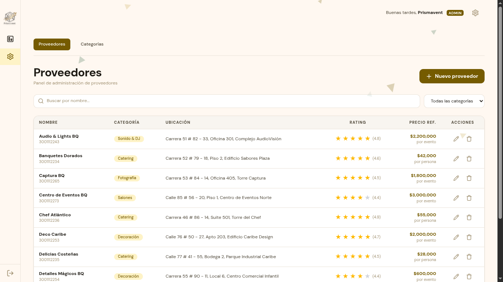 |

| Editar Categorías |
|---|
| 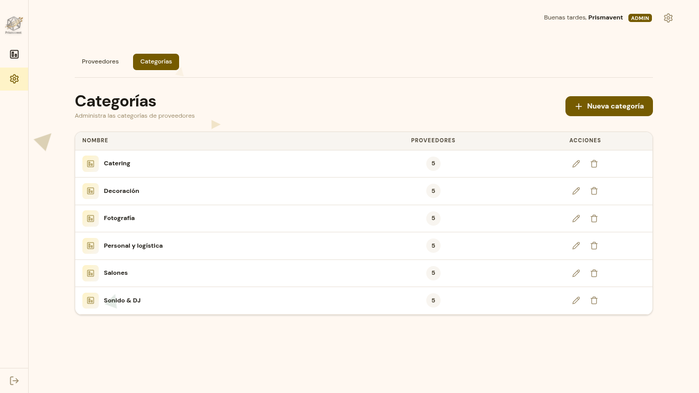 |

---

## Stack Tecnológico

| Capa | Tecnología | Propósito |
|---|---|---|
| **Frontend** | HTML5 + CSS3 + JavaScript Vanilla | SPA sin frameworks |
| **Estilos** | Tailwind CSS v4 | Diseño utility-first |
| **Backend** | Python 3.11+ / FastAPI | API REST asíncrona |
| **Base de datos** | PostgreSQL 15 (Supabase) | Persistencia y Auth |
| **Autenticación** | Supabase Auth + JWT | Registro, login, roles |
| **Validación** | Pydantic v2 | Schemas request/response |
| **Servidor ASGI** | Uvicorn | Servidor de producción |
| **Rate limiting** | slowapi | 5 intentos/min en auth |
| **Despliegue** | Vercel (frontend) + Google Cloud (backend) | Producción |

---

## Arquitectura

```
┌──────────────────────────────────────────────────────┐
│              CLIENTE (Navegador / Vercel)             │
│ SPA: HTML5 + Tailwind CSS + JavaScript Vanilla       │
│ 15 páginas · 23 componentes · Router pushState       │
└───────────────┬──────────────────────────────────────┘
                │ HTTPS (JSON)
                ▼
┌──────────────────────────────────────────────────────┐
│              FASTAPI (Google Cloud / e2)              │
│                                                      │
│  Middlewares: SecurityHeaders → Auth → CORS           │
│  15 routers · 12 services · 14 schemas               │
│  10 modelos SQLAlchemy · SlowAPI rate limiting       │
└───────────────┬──────────────────────────────────────┘
                │ SQL (supabase-py)
                ▼
┌──────────────────────────────────────────────────────┐
│              SUPABASE (PostgreSQL 15)                 │
│                                                      │
│  13 tablas · Auth integrado · Row Level Security     │
│  Triggers: updated_at, rating, template validation   │
└──────────────────────────────────────────────────────┘
```

---

## Características

### Para organizadores de eventos

| Funcionalidad | Descripción |
|---|---|
| **Creación de eventos** | Desde plantillas predefinidas (Boda, Cumpleaños, Tech, Personalizado) o desde cero |
| **Gestión de recursos** | Añade, edita y elimina recursos con cantidades y precios |
| **Control de presupuesto** | Presupuesto estimado automático con alertas al superar el límite |
| **Invitados** | Registro, confirmación RSVP y conteo de asistentes |
| **Tablero Kanban** | Tareas organizadas en: Por Hacer, En Progreso, Realizado con drag & drop |
| **Proveedores** | Catálogo local con filtros por categoría y búsqueda |
| **Clima** | Pronóstico integrado para la fecha del evento (OpenWeatherMap) |
| **Historial** | Eventos finalizados con resumen y línea de tiempo de cambios |
| **Dashboard** | Estadísticas, próximos eventos y acceso rápido |

### Para administradores

| Funcionalidad | Descripción |
|---|---|
| **CRUD de proveedores** | Tabla con búsqueda, filtros y paginación |
| **CRUD de categorías** | Gestión de categorías con integridad referencial |
| **Métricas** | Dashboard con totales, distribución por estado y más |
| **Sidebar exclusivo** | Navegación adaptada al rol |

---

## Instalación Local

### Requisitos
- Python 3.11+, Node.js 18+, Docker (opcional)

### Backend

```bash
git clone https://github.com/dypok/prismavent.git
cd prismavent/backend

python -m venv venv
source venv/bin/activate  # Windows: venv\Scripts\activate
pip install -r requirements.txt

cp .env.example .env  # Configurar credenciales de Supabase
uvicorn app.main:app --reload --port 8000
```

### Backend con Docker

```bash
cd prismavent/backend
docker compose up -d
```

### Frontend

```bash
cd prismavent/frontend
npm install
npm run dev
```

Disponible en `http://localhost:5173`.

### Variables de Entorno

| Variable | Descripción |
|---|---|
| `DATABASE_URL` | URL de conexión PostgreSQL |
| `SUPABASE_URL` | URL del proyecto Supabase |
| `SUPABASE_ANON_KEY` | Clave anónima de Supabase |
| `SUPABASE_JWT_SECRET` | Secreto JWT de Supabase |
| `OPENWEATHER_API_KEY` | API key de OpenWeatherMap |
| `VITE_API_URL` | URL del backend (para frontend en producción) |

---

## API Endpoints

### Autenticación
| Método | Ruta | Descripción |
|---|---|---|
| POST | `/auth/register` | Registro de usuario |
| POST | `/auth/login` | Inicio de sesión |
| POST | `/auth/logout` | Cierre de sesión |
| GET | `/auth/me` | Perfil del usuario autenticado |
| PUT | `/auth/profile` | Actualizar nombre/contraseña |

### Eventos
| Método | Ruta | Descripción |
|---|---|---|
| GET | `/events` | Listar eventos del usuario (filtrable por status) |
| POST | `/events` | Crear evento (con o sin plantilla) |
| GET | `/events/{id}` | Detalle del evento con recursos, invitados y presupuesto |
| PATCH | `/events/{id}` | Editar evento |
| DELETE | `/events/{id}` | Eliminar evento (solo borrador) |
| PATCH | `/events/{id}/status` | Cambiar estado (borrador → confirmado) |
| GET | `/events/{id}/history` | Historial de cambios de estado |

### Recursos, Invitados y Tareas
| Método | Ruta | Descripción |
|---|---|---|
| GET/POST | `/events/{id}/items` | CRUD recursos del evento |
| PATCH/DELETE | `/events/{id}/items/{iid}` | Editar/eliminar recurso |
| GET/POST | `/events/{id}/guests` | CRUD invitados |
| PATCH/DELETE | `/events/{id}/guests/{gid}` | Editar/eliminar invitado |
| GET/POST | `/events/{id}/tasks` | CRUD tareas Kanban |
| PATCH | `/events/{id}/tasks/{tid}/move` | Mover tarea entre columnas |

### Proveedores y Catálogo
| Método | Ruta | Descripción |
|---|---|---|
| GET | `/providers` | Listar proveedores (filtrable por categoría y búsqueda) |
| GET | `/providers/{id}` | Detalle del proveedor |
| GET | `/provider-categories` | Listar categorías de proveedores |
| GET | `/templates` | Listar plantillas del sistema |
| GET | `/cities` | Listar ciudades disponibles |
| GET | `/stats` | Estadísticas públicas (sin autenticación) |
| GET | `/events/{id}/weather` | Pronóstico del clima para el evento |

### Administración (solo admin)
| Método | Ruta | Descripción |
|---|---|---|
| GET | `/admin/providers` | Listar proveedores (paginado, con filtros) |
| POST | `/admin/providers` | Crear proveedor |
| PUT | `/admin/providers/{id}` | Actualizar proveedor |
| DELETE | `/admin/providers/{id}` | Eliminar proveedor |
| GET/POST/PUT/DELETE | `/admin/provider-categories` | CRUD categorías |
| GET | `/admin/metrics` | Métricas del dashboard admin |

Documentación interactiva: `http://localhost:8000/docs` (Swagger UI).

---

## Estructura del Proyecto

```
prismavent/
├── backend/                     # API REST con FastAPI
│   ├── app/
│   │   ├── main.py              # Entry point + middlewares
│   │   ├── database.py          # SQLAlchemy + pool config
│   │   ├── dependencies.py      # get_current_user, require_admin
│   │   ├── core/                # Supabase client, rate limit
│   │   ├── middlewares/         # Auth JWT, Security Headers
│   │   ├── routers/     (15)    # Endpoints HTTP
│   │   ├── services/    (12)    # Lógica de negocio
│   │   ├── schemas/     (14)    # Validación Pydantic
│   │   ├── models/      (10)    # Modelos SQLAlchemy
│   │   └── utils/               # sanitize, validate UUID
│   ├── docs/                    # Documentación backend
│   ├── requirements.txt
│   └── Dockerfile
│
├── frontend/                    # SPA con Vanilla JS
│   ├── index.html               # Entry point + SEO meta
│   ├── vercel.json              # SPA fallback para Vercel
│   ├── src/
│   │   ├── main.js              # Router SPA (17 rutas)
│   │   ├── style.css            # Tailwind + animaciones
│   │   ├── pages/      (15)     # Páginas SPA
│   │   ├── components/  (23)    # Componentes reutilizables
│   │   └── service/api.js      # Cliente API centralizado
│   └── package.json
│
├── documentation/               # User Stories documentadas
│   ├── UH1-87.md ... UH14-215.md
│   ├── UH-LandingPage.md
│   └── screenshots/             # Capturas de pantalla
│
└── README.md
```

---

## Enlaces

| Recurso | URL |
|---|---|
| Repositorio | [https://github.com/dypok/prismavent](https://github.com/dypok/prismavent) |
| Frontend (Vercel) | [https://prismavent.vercel.app](https://prismavent.vercel.app) |
| Documentación API | `/docs` (local) o `/docs` en el backend desplegado |

---

<p align="center">
  <strong>Prismavent</strong> — <em>From start to glow, we've got the flow.</em><br>
  <a href="https://github.com/dypok/prismavent">https://github.com/dypok/prismavent</a>
</p>
