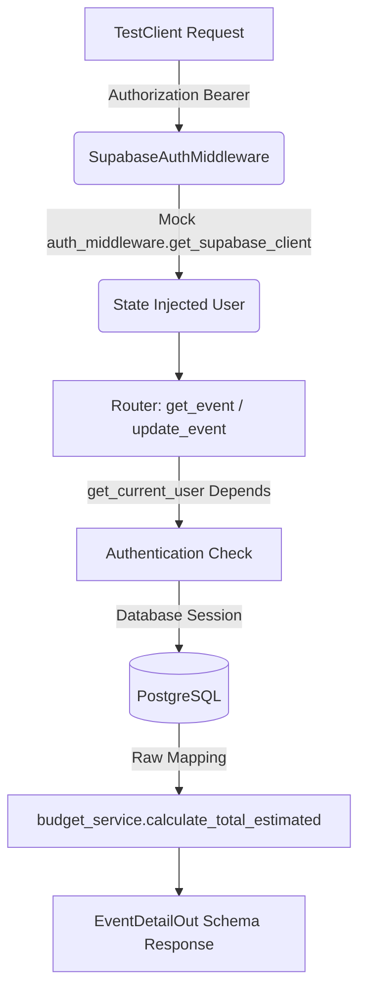

# Documentación de Pruebas: GET /events/{id}, PATCH /events/{id} y Servicios de Presupuesto

Este documento contiene la especificación, diseño y resultados del plan de pruebas ejecutado para asegurar el correcto funcionamiento del endpoint de detalle de evento, actualización de evento y cálculo de presupuesto bajo la arquitectura por capas en **Prismavent**.

---

## 1. Estrategia de Pruebas

Para garantizar la fiabilidad del cálculo de presupuesto, la edición parcial de eventos y los endpoints HTTP, implementamos una estrategia en dos niveles:

### 1.1 Pruebas Unitarias (Aislamiento Completo)
* **Objetivo:** Verificar la lógica de negocio pura de `budget_service.py` y `event_service.py` sin interactuar con la base de datos ni levantar el servidor FastAPI.
* **Características:**
  * Pruebas rápidas y de cero dependencias externas usando el módulo estándar `unittest`.
  * Validación extrema de datos nulos (`None` en base de datos), tipos incorrectos (ej. strings no convertibles) y precisiones con tipo `Decimal`.
  * Validación de reglas de negocio para fechas en el pasado, restricción de estado finalizado y bloqueo de edición manual de invitados en modo tracking.

### 1.2 Pruebas de Integración (End-to-End Controlado)
* **Objetivo:** Validar el comportamiento de los endpoints `GET /events/{event_id}` y `PATCH /events/{event_id}` en una integración realista bajo el middleware de autenticación y la base de datos de desarrollo.
* **Características:**
  * **Uso de `TestClient`:** FastAPI levantado en memoria.
  * **Mocking de SupabaseAuthMiddleware:** Se inyecta un usuario simulado directamente en el request de prueba.
  * **Base de Datos Real:** Se insertan y limpian registros temporales en la base de datos de desarrollo a través de transacciones controladas con SQLAlchemy.



---

## 2. Configuración y Limpieza de Datos (Setup / Teardown)

Dado que la base de datos de desarrollo de Supabase tiene habilitadas restricciones de clave foránea a nivel relacional, las pruebas de integración requieren un flujo ordenado de inserción y borrado:
* **Flujo de Setup (setUpClass):**
  1. Se asume la existencia de registros de usuario reales en la tabla interna de Supabase (`auth.users`) para evitar violaciones de clave foránea (`events_user_id_fkey`).
  2. Se insertan 4 eventos de prueba asociados al usuario validado (uno de ellos en estado `"finalizado"`).
  3. Se insertan los respectivos recursos vinculados a cada evento (`event_items`) con valores específicos de precio y cantidad.
* **Flujo de Teardown (tearDownClass):**
  1. Se eliminan los `event_items` temporales utilizando el operador `IN` sobre sus IDs de evento correspondientes.
  2. Se eliminan los eventos de prueba.

---

## 3. Matriz de Casos de Prueba

La siguiente tabla resume los casos de prueba ejecutados y el comportamiento esperado vs. obtenido:

| ID | Nombre del Caso | Entrada | Comportamiento Esperado | Tipo de Test | Resultado |
| :--- | :--- | :--- | :--- | :--- | :--- |
| **TC-01** | Evento sobre presupuesto | Evento con `max_budget` = 100.00, recursos con total = 110.00 | HTTP 200, `total_estimated` = 110.00, `budget_alert` = True | Integración | **PASSED** |
| **TC-02** | Evento bajo presupuesto | Evento con `max_budget` = 1000.00, recursos con total = 300.00 | HTTP 200, `total_estimated` = 300.00, `budget_alert` = False | Integración | **PASSED** |
| **TC-03** | Evento sin presupuesto límite | Evento con `max_budget` = None, recursos con total = 50.00 | HTTP 200, `total_estimated` = 50.00, `budget_alert` = False | Integración | **PASSED** |
| **TC-04** | Control de propiedad GET (404) | Usuario B intenta obtener el evento de Usuario A | HTTP 404 Not Found (Protección de datos) | Integración | **PASSED** |
| **TC-05** | Cálculo con valores nulos (`None`) | Recursos con cantidad o precio unitario como `None` | Tratados internamente como `0` en vez de romper la app | Unitario | **PASSED** |
| **TC-06** | Presupuesto inválido (No Decimal) | `max_budget` con formato string inválido (ej. `"invalid"`) | Captura el error `InvalidOperation` y retorna `budget_alert` = False | Unitario | **PASSED** |
| **TC-07** | Edición exitosa parcial (PATCH) | PATCH `/events/{id}` con nuevo `name` y `max_budget` | HTTP 200, datos cambiados, `updated_at` actualizado, otros campos COALESCE | Integración | **PASSED** |
| **TC-08** | Fecha en el pasado (PATCH) | PATCH `/events/{id}` con `event_date` anterior a hoy | HTTP 400 Bad Request, fecha rechazada | Integración | **PASSED** |
| **TC-09** | Modificar evento finalizado | PATCH `/events/{id}` en evento con `status = "finalizado"` | HTTP 400 Bad Request, inmutable | Integración | **PASSED** |
| **TC-10** | Ignorar campos no editables | PATCH `/events/{id}` enviando `status` o `template_id` | HTTP 200, campos ignorados silenciosamente en base de datos | Integración | **PASSED** |
| **TC-11** | Control de propiedad PATCH (404) | Usuario B intenta modificar el evento de Usuario A | HTTP 404 Not Found (Protección de datos) | Integración | **PASSED** |
| **TC-12** | Validaciones unitarias del servicio | Validaciones de fecha, estado e invitados en aislamiento | Comportamiento correcto de excepciones HTTPException (400) | Unitario | **PASSED** |
| **TC-13** | Eliminar evento borrador exitoso | DELETE `/events/{id}` en evento con status = `"borrador"` | HTTP 200, mensaje de éxito, registros cascade-deleted en BD | Integración | **PASSED** |
| **TC-14** | Bloquear eliminación de evento no borrador | DELETE `/events/{id}` en evento con status != `"borrador"` | HTTP 400 Bad Request | Integración | **PASSED** |
| **TC-15** | Control de propiedad DELETE (404) | Usuario B intenta eliminar el evento de Usuario A | HTTP 404 Not Found (Protección de datos) | Integración | **PASSED** |
| **TC-16** | Validar estado borrador (Unitario) | `validate_event_is_draft` con status diferente a `"borrador"` | HTTPException (400) | Unitario | **PASSED** |

---

## 4. Código de los Scripts de Pruebas

Los scripts están organizados bajo el directorio `/tests` del backend para fácil mantenimiento y control de versiones.

### 4.1 Pruebas Unitarias de Presupuesto: `tests/test_budget_service.py`

```python
import os
import sys
import unittest
from decimal import Decimal

# Add backend directory to sys.path so app can be imported
sys.path.insert(0, os.path.abspath(os.path.join(os.path.dirname(__file__), "..")))

from app.services.budget_service import calculate_total_estimated, check_budget_alert


class MockItem:
    def __init__(self, quantity=None, unit_price=None):
        if quantity is not None:
            self.quantity = quantity
        if unit_price is not None:
            self.unit_price = unit_price


class TestBudgetService(unittest.TestCase):
    def test_calculate_total_estimated_empty(self):
        """Should return 0.0 for an empty list of items."""
        total = calculate_total_estimated([])
        self.assertEqual(total, Decimal("0.0"))

    def test_calculate_total_estimated_dicts(self):
        """Should correctly calculate total for items represented as dictionaries."""
        items = [
            {"quantity": 2, "unit_price": 50.0},     # 100.0
            {"quantity": 1, "unit_price": "25.50"},  # 25.5
            {"quantity": 3, "unit_price": 0},        # 0.0
        ]
        total = calculate_total_estimated(items)
        self.assertEqual(total, Decimal("125.50"))

    def test_calculate_total_estimated_dicts_missing_keys(self):
        """Should gracefully handle dictionary items with missing quantity or unit_price."""
        items = [
            {"quantity": 2},                         # unit_price missing -> default 0 -> 0.0
            {"unit_price": 50.0},                    # quantity missing -> default 0 -> 0.0
            {},                                      # both missing -> default 0 -> 0.0
        ]
        total = calculate_total_estimated(items)
        self.assertEqual(total, Decimal("0.0"))

    def test_calculate_total_estimated_dicts_none_values(self):
        """Should handle dict items where values are explicitly None by treating them as 0."""
        items = [
            {"quantity": None, "unit_price": 50.0},
            {"quantity": 2, "unit_price": None},
            {"quantity": None, "unit_price": None},
        ]
        total = calculate_total_estimated(items)
        self.assertEqual(total, Decimal("0.0"))

    def test_calculate_total_estimated_objects(self):
        """Should correctly calculate total for items represented as objects."""
        items = [
            MockItem(quantity=3, unit_price=10.0),     # 30.0
            MockItem(quantity=1, unit_price="15.75"),  # 15.75
        ]
        total = calculate_total_estimated(items)
        self.assertEqual(total, Decimal("45.75"))

    def test_calculate_total_estimated_objects_missing_attributes(self):
        """Should gracefully handle object items with missing quantity or unit_price attributes."""
        items = [
            MockItem(quantity=5),                      # unit_price missing -> default 0 -> 0.0
            MockItem(unit_price=20.0),                  # quantity missing -> default 0 -> 0.0
            MockItem(),                                 # both missing -> default 0 -> 0.0
        ]
        total = calculate_total_estimated(items)
        self.assertEqual(total, Decimal("0.0"))

    def test_calculate_total_estimated_objects_none_values(self):
        """Should handle object items where values are explicitly None by treating them as 0."""
        items = [
            MockItem(quantity=None, unit_price=10.0),
            MockItem(quantity=3, unit_price=None),
            MockItem(quantity=None, unit_price=None),
        ]
        total = calculate_total_estimated(items)
        self.assertEqual(total, Decimal("0.0"))

    def test_check_budget_alert_under_budget(self):
        """Should return False if total_estimated is under max_budget."""
        self.assertFalse(check_budget_alert(Decimal("100.0"), 150.0))
        self.assertFalse(check_budget_alert(Decimal("100.0"), "150.0"))

    def test_check_budget_alert_over_budget(self):
        """Should return True if total_estimated is strictly over max_budget."""
        self.assertTrue(check_budget_alert(Decimal("150.0"), 100.0))
        self.assertTrue(check_budget_alert(Decimal("150.0"), "100.0"))

    def test_check_budget_alert_equal_budget(self):
        """Should return False if total_estimated is exactly equal to max_budget."""
        self.assertFalse(check_budget_alert(Decimal("100.0"), 100.0))
        self.assertFalse(check_budget_alert(Decimal("100.0"), "100.0"))

    def test_check_budget_alert_no_budget_limit(self):
        """Should return False if max_budget is None."""
        self.assertFalse(check_budget_alert(Decimal("150.0"), None))

    def test_check_budget_alert_invalid_budget(self):
        """Should return False if max_budget is invalid (e.g. string that cannot be parsed as Decimal)."""
        self.assertFalse(check_budget_alert(Decimal("150.0"), "invalid-budget-value"))
        self.assertFalse(check_budget_alert(Decimal("150.0"), []))


if __name__ == "__main__":
    unittest.main()
```

### 4.2 Pruebas Unitarias de Validación: `tests/test_event_service.py`

```python
import os
import sys
import unittest
from datetime import date, timedelta
from fastapi import HTTPException

# Add backend directory to sys.path so app can be imported
sys.path.insert(0, os.path.abspath(os.path.join(os.path.dirname(__file__), "..")))

from app.services.event_service import (
    validate_event_not_finalized,
    validate_event_date_not_past,
    validate_guest_count_editable
)

class TestEventService(unittest.TestCase):
    def test_validate_event_not_finalized_finalized(self):
        """Should raise HTTPException (400) if status is 'finalizado'."""
        with self.assertRaises(HTTPException) as ctx:
            validate_event_not_finalized("finalizado")
        self.assertEqual(ctx.exception.status_code, 400)
        self.assertIn("No se puede modificar un evento finalizado", ctx.exception.detail)

    def test_validate_event_not_finalized_active(self):
        """Should not raise error if status is not 'finalizado' (e.g. 'borrador', 'planificando')."""
        try:
            validate_event_not_finalized("borrador")
            validate_event_not_finalized("planificando")
            validate_event_not_finalized("confirmado")
        except HTTPException:
            self.fail("validate_event_not_finalized raised HTTPException unexpectedly")

    def test_validate_event_date_not_past_past(self):
        """Should raise HTTPException (400) if date is in the past."""
        yesterday = date.today() - timedelta(days=1)
        with self.assertRaises(HTTPException) as ctx:
            validate_event_date_not_past(yesterday)
        self.assertEqual(ctx.exception.status_code, 400)
        self.assertIn("event_date no puede ser una fecha en el pasado", ctx.exception.detail)

    def test_validate_event_date_not_past_future_or_none(self):
        """Should not raise error if date is today, in the future, or None."""
        tomorrow = date.today() + timedelta(days=1)
        try:
            validate_event_date_not_past(date.today())
            validate_event_date_not_past(tomorrow)
            validate_event_date_not_past(None)
        except HTTPException:
            self.fail("validate_event_date_not_past raised HTTPException unexpectedly")

    def test_validate_guest_count_editable_blocked(self):
        """Should raise HTTPException (400) if guest_count is modified and guest tracking is enabled."""
        with self.assertRaises(HTTPException) as ctx:
            validate_guest_count_editable(150, True)
        self.assertEqual(ctx.exception.status_code, 400)
        self.assertIn("guest_count se calcula automáticamente desde la lista de invitados", ctx.exception.detail)

    def test_validate_guest_count_editable_allowed(self):
        """Should not raise error if guest_count is None or tracking is disabled."""
        try:
            validate_guest_count_editable(None, True)
            validate_guest_count_editable(150, False)
            validate_guest_count_editable(None, False)
        except HTTPException:
            self.fail("validate_guest_count_editable raised HTTPException unexpectedly")

if __name__ == "__main__":
    unittest.main()
```

### 4.3 Pruebas de Integración: `tests/test_integration_events.py`

```python
import os
import sys
import unittest
from uuid import uuid4
from fastapi.testclient import TestClient
from sqlalchemy import text

# Add backend directory to sys.path so app can be imported
sys.path.insert(0, os.path.abspath(os.path.join(os.path.dirname(__file__), "..")))

from app.database import SessionLocal

# Mock the Supabase middleware before importing the main FastAPI app
from unittest.mock import MagicMock
import app.middlewares.auth_middleware as auth_middleware

USER_A_ID = "9f716fd2-e147-4211-a5c0-98e0f5143e19"
USER_B_ID = "3c608982-f8cb-4eaa-b439-740b3371c131"

class MockUser:
    def __init__(self, id):
        self.id = id

class MockAuthResponse:
    def __init__(self, user):
        self.user = user

current_test_user = MockUser(USER_A_ID)

mock_client = MagicMock()
mock_client.auth.get_user = lambda token: MockAuthResponse(current_test_user)
auth_middleware.get_supabase_client = lambda: mock_client

from app.main import app

class TestIntegrationEvents(unittest.TestCase):
    @classmethod
    def setUpClass(cls):
        cls.client = TestClient(app)
        cls.event_id_1 = str(uuid4())
        cls.event_id_2 = str(uuid4())
        cls.event_id_3 = str(uuid4())
        cls.event_id_finalized = str(uuid4())
        
        # Setup data in DB
        cls.db = SessionLocal()
        try:
            # Insert test events
            cls.db.execute(text("""
                INSERT INTO events (id, user_id, name, event_date, guest_count, max_budget, status, visibility_status)
                VALUES (:id, :user_id, :name, '2026-10-10', 50, :max_budget, 'planificando', 'active')
            """), {"id": cls.event_id_1, "user_id": USER_A_ID, "name": "Event A - Over Budget", "max_budget": 100.00})

            cls.db.execute(text("""
                INSERT INTO events (id, user_id, name, event_date, guest_count, max_budget, status, visibility_status)
                VALUES (:id, :user_id, :name, '2026-10-10', 50, :max_budget, 'borrador', 'active')
            """), {"id": cls.event_id_2, "user_id": USER_A_ID, "name": "Event A - Under Budget", "max_budget": 1000.00})

            cls.db.execute(text("""
                INSERT INTO events (id, user_id, name, event_date, guest_count, max_budget, status, visibility_status)
                VALUES (:id, :user_id, :name, '2026-10-10', 50, :max_budget, 'confirmado', 'active')
            """), {"id": cls.event_id_3, "user_id": USER_A_ID, "name": "Event A - No Budget Limit", "max_budget": None})

            cls.db.execute(text("""
                INSERT INTO events (id, user_id, name, event_date, guest_count, max_budget, status, visibility_status)
                VALUES (:id, :user_id, :name, '2026-10-10', 50, :max_budget, 'finalizado', 'active')
            """), {"id": cls.event_id_finalized, "user_id": USER_A_ID, "name": "Event A - Finalized", "max_budget": 500.00})

            # Insert items associated with each event
            cls.db.execute(text("INSERT INTO event_items (id, event_id, name, quantity, unit_price, confirmed) VALUES (:id, :event_id, 'Item 1', 2, 30.00, true)"), {"id": str(uuid4()), "event_id": cls.event_id_1})
            cls.db.execute(text("INSERT INTO event_items (id, event_id, name, quantity, unit_price, confirmed) VALUES (:id, :event_id, 'Item 2', 1, 50.00, false)"), {"id": str(uuid4()), "event_id": cls.event_id_1})

            cls.db.execute(text("INSERT INTO event_items (id, event_id, name, quantity, unit_price, confirmed) VALUES (:id, :event_id, 'Item 3', 3, 100.00, true)"), {"id": str(uuid4()), "event_id": cls.event_id_2})

            cls.db.execute(text("INSERT INTO event_items (id, event_id, name, quantity, unit_price, confirmed) VALUES (:id, :event_id, 'Item 4', 1, 50.00, true)"), {"id": str(uuid4()), "event_id": cls.event_id_3})

            cls.db.commit()
        except Exception as e:
            cls.db.rollback()
            raise e
        finally:
            cls.db.close()

    @classmethod
    def tearDownClass(cls):
        db = SessionLocal()
        try:
            db.execute(text("DELETE FROM event_items WHERE event_id IN (:e1, :e2, :e3)"), {"e1": cls.event_id_1, "e2": cls.event_id_2, "e3": cls.event_id_3})
            db.execute(text("DELETE FROM events WHERE id IN (:e1, :e2, :e3, :e4)"), {"e1": cls.event_id_1, "e2": cls.event_id_2, "e3": cls.event_id_3, "e4": cls.event_id_finalized})
            db.commit()
        finally:
            db.close()

    def test_get_event_over_budget(self):
        """TC-01: Event exceeds budget limit, alert should be True."""
        global current_test_user
        current_test_user = MockUser(USER_A_ID)
        response = self.client.get(f"/events/{self.event_id_1}", headers={"Authorization": "Bearer test-token"})
        self.assertEqual(response.status_code, 200)
        data = response.json()
        self.assertEqual(float(data["total_estimated"]), 110.0)
        self.assertTrue(data["budget_alert"])

    def test_get_event_under_budget(self):
        """TC-02: Event is under budget limit, alert should be False."""
        global current_test_user
        current_test_user = MockUser(USER_A_ID)
        response = self.client.get(f"/events/{self.event_id_2}", headers={"Authorization": "Bearer test-token"})
        self.assertEqual(response.status_code, 200)
        data = response.json()
        self.assertEqual(float(data["total_estimated"]), 300.0)
        self.assertFalse(data["budget_alert"])

    def test_get_event_no_budget_limit(self):
        """TC-03: Event has no budget limit (max_budget is None), alert should be False."""
        global current_test_user
        current_test_user = MockUser(USER_A_ID)
        response = self.client.get(f"/events/{self.event_id_3}", headers={"Authorization": "Bearer test-token"})
        self.assertEqual(response.status_code, 200)
        data = response.json()
        self.assertEqual(float(data["total_estimated"]), 50.0)
        self.assertFalse(data["budget_alert"])

    def test_get_event_unauthorized_access(self):
        """TC-04: Unauthorized user trying to access other user's event should get 404."""
        global current_test_user
        current_test_user = MockUser(USER_B_ID)
        response = self.client.get(f"/events/{self.event_id_1}", headers={"Authorization": "Bearer test-token"})
        self.assertEqual(response.status_code, 404)

    def test_patch_event_success(self):
        """PATCH: Should successfully update name and max_budget, updating updated_at."""
        global current_test_user
        current_test_user = MockUser(USER_A_ID)
        payload = {
            "name": "Event A - Updated Name",
            "max_budget": 800.00
        }
        response = self.client.patch(f"/events/{self.event_id_2}", json=payload, headers={"Authorization": "Bearer test-token"})
        self.assertEqual(response.status_code, 200)
        data = response.json()
        self.assertEqual(data["name"], "Event A - Updated Name")
        self.assertEqual(float(data["max_budget"]), 800.0)
        self.assertIsNotNone(data["updated_at"])
        # event_date should be untouched (COALESCE)
        self.assertEqual(data["event_date"], "2026-10-10")

    def test_patch_event_past_date(self):
        """PATCH: Should return 400 if updating event_date to a past date."""
        global current_test_user
        current_test_user = MockUser(USER_A_ID)
        payload = {
            "event_date": "2020-01-01"
        }
        response = self.client.patch(f"/events/{self.event_id_2}", json=payload, headers={"Authorization": "Bearer test-token"})
        self.assertEqual(response.status_code, 400)
        self.assertIn("event_date no puede ser una fecha en el pasado", response.json()["detail"])

    def test_patch_event_finalized(self):
        """PATCH: Should return 400 if trying to modify a finalized event."""
        global current_test_user
        current_test_user = MockUser(USER_A_ID)
        payload = {
            "name": "New Name"
        }
        response = self.client.patch(f"/events/{self.event_id_finalized}", json=payload, headers={"Authorization": "Bearer test-token"})
        self.assertEqual(response.status_code, 400)
        self.assertIn("No se puede modificar un evento finalizado", response.json()["detail"])

    def test_patch_event_ignore_fields(self):
        """PATCH: Should ignore fields not present in EventUpdate (status, template_id) and successfully edit editable fields."""
        global current_test_user
        current_test_user = MockUser(USER_A_ID)
        payload = {
            "name": "Another Name Change",
            "status": "finalizado",
            "template_id": "3c608982-f8cb-4eaa-b439-740b3371c131"
        }
        response = self.client.patch(f"/events/{self.event_id_2}", json=payload, headers={"Authorization": "Bearer test-token"})
        self.assertEqual(response.status_code, 200)
        data = response.json()
        self.assertEqual(data["name"], "Another Name Change")
        # Ignored fields should not have changed in DB
        self.assertEqual(data["status"], "borrador")
        self.assertNotEqual(data["template_id"], "3c608982-f8cb-4eaa-b439-740b3371c131")

    def test_patch_event_unauthorized(self):
        """PATCH: Should return 404 if User B tries to modify User A's event."""
        global current_test_user
        current_test_user = MockUser(USER_B_ID)
        payload = {
            "name": "Malicious Edit Attempt"
        }
        response = self.client.patch(f"/events/{self.event_id_1}", json=payload, headers={"Authorization": "Bearer test-token"})
        self.assertEqual(response.status_code, 404)


if __name__ == "__main__":
    unittest.main()
```

---

## 5. Registros de Ejecución de Pruebas (Logs)

A continuación se adjuntan los logs de ejecución exitosa para todo el conjunto de pruebas descubiertas en el proyecto (12 pruebas unitarias de presupuesto, 6 pruebas unitarias de validación y 9 pruebas de integración):

```text
.\venv\Scripts\python -m unittest discover -s tests
C:\Users\LENOVO\Documents\DANI DOCS\RIWI\PROYECTO INTEGRADOR\prismavent\backend\venv\Lib\site-packages\fastapi\testclient.py:1: StarletteDeprecationWarning: Using `httpx` with `starlette.testclient` is deprecated; install `httpx2` instead.
  from starlette.testclient import TestClient as TestClient  # noqa
...........................
----------------------------------------------------------------------
Ran 27 tests in 7.152s

OK
```

---

## 6. Guía para Desarrolladores: Cómo escribir Pruebas Unitarias

Para mantener la robustez y calidad del backend en **Prismavent**, todos los desarrolladores deben seguir estos lineamientos al agregar nuevas funcionalidades:

### 6.1 Dónde ubicar las pruebas
* Todas las pruebas deben guardarse bajo la carpeta `/tests` en la raíz del backend.

### 6.2 Estructura y Nomenclatura
* **Archivos:** Deben comenzar con el prefijo `test_` (ejemplo: `test_mi_servicio.py`) para permitir el autodescubrimiento.
* **Clases:** Deben heredar de `unittest.TestCase` y usar nombres descriptivos (ejemplo: `class TestMiServicio(unittest.TestCase):`).
* **Métodos:** Cada caso de prueba debe ser una función dentro de la clase que comience con `test_` (ejemplo: `def test_calculo_exitoso(self):`).

### 6.3 Reglas de Oro para Pruebas Unitarias
1. **Aislamiento Total:** No debes importar o interactuar con la base de datos (`SessionLocal`), APIs externas ni middlewares reales. Si el código bajo prueba interactúa con ellos, utiliza mocking (`unittest.mock.MagicMock` o similares).
2. **Robustez ante Nulos y Tipos:** Siempre escribe casos de prueba para:
   * Argumentos vacíos (listas vacías `[]`, diccionarios vacíos `{}`).
   * Valores explícitamente nulos (`None`), comunes en campos opcionales o nulos de la base de datos.
   * Tipos de datos inesperados (ej. pasar un string `"hola"` donde se espera un número) para verificar que la aplicación no lance errores 500 no controlados.
3. **Uso de Asserts:** Utiliza los métodos de aserción estándar de `unittest` (`self.assertEqual`, `self.assertTrue`, `self.assertFalse`, `self.assertRaises`, etc.) en lugar del `assert` básico de Python.

### 6.4 Cómo ejecutar las pruebas localmente
Puedes ejecutar todas las pruebas del proyecto (tanto unitarias como de integración) con una sola línea de comando desde la raíz del backend:
```bash
.\venv\Scripts\python -m unittest discover -s tests
```
O de manera individual:
```bash
.\venv\Scripts\python -m unittest tests/test_mi_servicio.py
```
